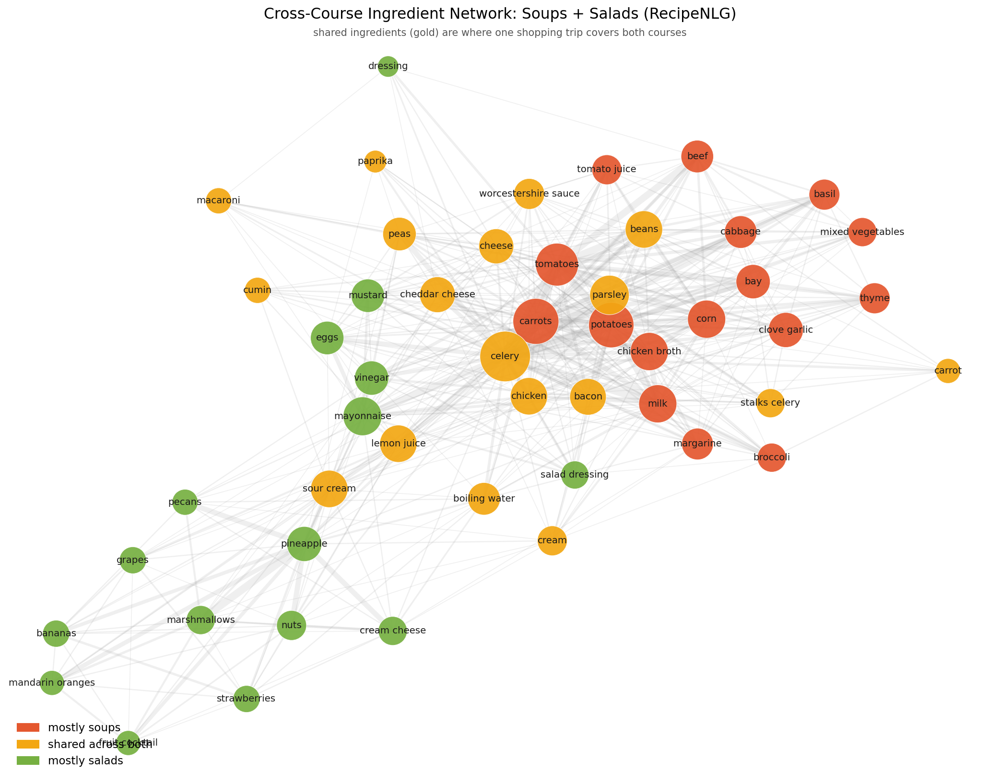

# Recipe Meal Planner: Graph-Based Ingredient Recommender

## Why I built it

My parents live in a rural area and sometimes drive an hour for one or two
dinner ingredients. The goal: cut the cost and cognitive load of dinner by
suggesting dishes that share ingredients, avoiding single-item trips.

## How it works

Pick two course types (say soups and salads). The pipeline ranks each course's
top co-occurring ingredients, drops pantry staples, intersects what's left, and
recommends recipe pairs built on the shared ingredients, so one shopping trip
covers both. Ingredient and recipe co-occurrence graphs are built with NetworkX.

Built on ~1M Yummly recipes originally; runs on the open-licensed RecipeNLG
corpus today (see Get the data).



*Soups + salads from RecipeNLG. Gold ingredients are shared across both courses,
the overlap that lets one shopping trip cover two dishes.*

## Example

Cross-course recommendation (RecipeNLG sample, Soups + Salads):

```
Shared ingredients: bacon, celery, parsley

Recommended pair:
  Manhattan Clam Chowder + German Potato Salad
  → buy bacon, celery, and parsley once; make both
```

Community detection on the soup ingredient graph pulls out coherent ingredient
families. From the Yummly sample (194 soups, course labels provided):

```
  • Coconut/Asian:   coconut milk, ginger, cilantro, red bell pepper
  • Hearty/Western:  beef broth, crushed tomatoes, celery, zucchini, kale
  • Chicken/herb:    chicken breast, bay leaves, parsley, vegetable stock
```

On the RecipeNLG sample (159 soups, course inferred from titles) one cluster is
clearly Tex-Mex; another is more entertaining:

```
  • Tex-Mex:   chilies, pinto beans, hominy, taco seasoning
  • ??? :      tomato soup, nutmeg, raisins, cinnamon
```

That second group is "tomato soup cake" desserts. RecipeNLG has no course field,
so course is guessed from the recipe title, and a cake with "soup" in its name
slips into Soups. A fun illustration of the challenge with derived categories:
provided labels (Yummly) cluster cleaner than inferred ones.

## Get the data

To run on real data, grab the corpus from RecipeNLG yourself (it's
research-licensed, so not redistributed here):

1. Download `full_dataset.csv` from [RecipeNLG](https://recipenlg.cs.put.poznan.pl/)
   (accept the license), save it as `data/RecipeNLG_full_dataset.csv`.
2. Convert it to the pipeline's format (derives `course` from titles, reshapes
   to `id,name,course,ingredient`):
   ```bash
   python3 src/make_recipenlg_sample.py
   ```
   Tune `PER_COURSE` in the script for more or less data. It writes
   `data/recipenlg_sample.csv`, which `main.py` reads.
3. Run it: `cd src && python main.py` (Python 2.7). It compares two course
   types and prints the shared ingredients plus recommended recipe pairs. The
   converter tags six courses: Soups, Salads, Desserts, Breakfast and Brunch,
   Beverages, Cocktails.

## Tech

Python · Pandas · NumPy · NetworkX · MongoDB

## A fun footnote

After building this I found other people exploring similar ingredient/recipe
graphs: [Teng et al. (2011)](https://arxiv.org/abs/1111.3919),
a [Stanford CS224W project (2017)](https://snap.stanford.edu/class/cs224w-2017/projects/cs224w-34-final.pdf),
and a [2025 Nature Scientific Reports paper](https://pmc.ncbi.nlm.nih.gov/articles/PMC12491443/).
